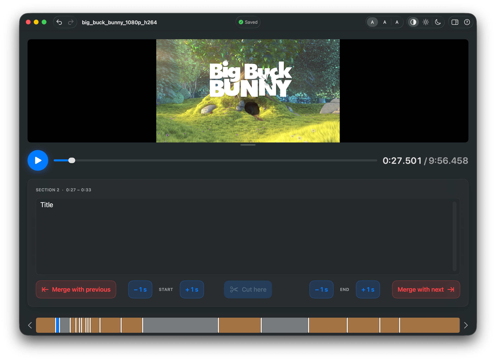

<p align="center">
  
</p>

<h1 align="center">Légendes</h1>

<p align="center">
  Describe your videos, section by section. Without the complicated software.
</p>

<p align="center">
  <a href="https://github.com/jerefrer/legendes/releases/latest/download/Legendes.dmg"><b>↓ Download for macOS</b></a>
  &nbsp;·&nbsp;
  <a href="https://jerefrer.github.io/legendes/">Website</a>
</p>

<p align="center">
  
</p>

## What it is

**Légendes** is a small, native macOS app for describing what happens in a video,
section by section. You open a video, split it into segments at each scene change,
and write a short description for each one. Everything is saved as a standard
`.srt` subtitle file — so the result works anywhere.

It's built to be **simple and forgiving**: large controls, an adjustable interface
size, light/dark themes, undo/redo, and automatic saving.

## Install

1. Download the latest **Légendes.app** from the [releases page](https://github.com/jerefrer/legendes/releases/latest).
2. Move it to your Applications folder and open it.
   (On first launch, right‑click the app → **Open** to bypass Gatekeeper, since the app isn't notarized yet.)

Requires macOS 14 or later.

## How to use

1. **Open a video** — drop it on the window (with its `.srt` if you have one), or click to pick files.
2. **Cut & describe** — play the video; press **Cut here** at each scene change and type what you see. Nudge a boundary by ±1 s (hold ⌥ for ±0.1 s).
3. **Done** — your sections are saved to a `.srt` next to the video, automatically.

## Build from source

```bash
swift run VideoTagging      # run during development
swift test                  # run the tests
./scripts/build-app.sh      # build a double-clickable Légendes.app
```

The pure logic (SRT parsing/writing, the contiguous-section model, undo, file
pairing) lives in the `VideoTaggingCore` library and is unit‑tested; the SwiftUI
app target is `VideoTagging`.

## Releases

Pushing a version tag builds and publishes a downloadable app:

```bash
git tag v0.1.0 && git push origin v0.1.0
```

A macOS GitHub Actions runner compiles the app, packages `Légendes.app` into a
`.dmg`, and attaches it to a GitHub Release (see
[`.github/workflows/release.yml`](.github/workflows/release.yml)).

## Signing & notarization (maintainer)

If these repository secrets are set, the release workflow signs the app with a
Developer ID, notarizes the `.dmg` with Apple, and staples the ticket — so it
opens with no Gatekeeper warning. Without them, the app is ad-hoc signed
(right‑click → Open on first launch). Add them under **Settings → Secrets and
variables → Actions**:

| Secret | What |
|---|---|
| `MACOS_CERT_P12_BASE64` | Your **Developer ID Application** certificate exported as `.p12`, base64‑encoded (`base64 -i cert.p12 \| pbcopy`). |
| `MACOS_CERT_PASSWORD` | The password you set when exporting the `.p12`. |
| `AC_API_KEY_ID` | App Store Connect **API key ID**. |
| `AC_API_ISSUER_ID` | App Store Connect **Issuer ID**. |
| `AC_API_KEY_P8_BASE64` | The API key `.p8` file, base64‑encoded (`base64 -i AuthKey_XXXX.p8 \| pbcopy`). |

The signing identity is auto‑detected from the imported certificate.

## Auto-update (Sparkle)

The app uses [Sparkle](https://sparkle-project.org). When the following are set,
each release also publishes a signed update archive (`Legendes.zip`) and an
`appcast.xml`; installed copies then check `…/releases/latest/download/appcast.xml`
and update themselves (a "Check for Updates…" item is in the app menu).

Generate a key pair once with Sparkle's `generate_keys`, then add:

| Where | Name | What |
|---|---|---|
| **Variables** | `SPARKLE_PUBLIC_KEY` | The EdDSA **public** key printed by `generate_keys` (baked into the app's Info.plist as `SUPublicEDKey`). |
| **Secrets** | `SPARKLE_PRIVATE_KEY` | The EdDSA **private** key (`generate_keys -x file`), used to sign each update. Never commit it. |

Note: auto-update only applies to installs that already include Sparkle — i.e.
from the first release built with these keys onward. Earlier copies update by
downloading the new DMG once.

---

<p align="center">By <a href="https://frerejeremy.me">Jérémy Frère</a></p>
